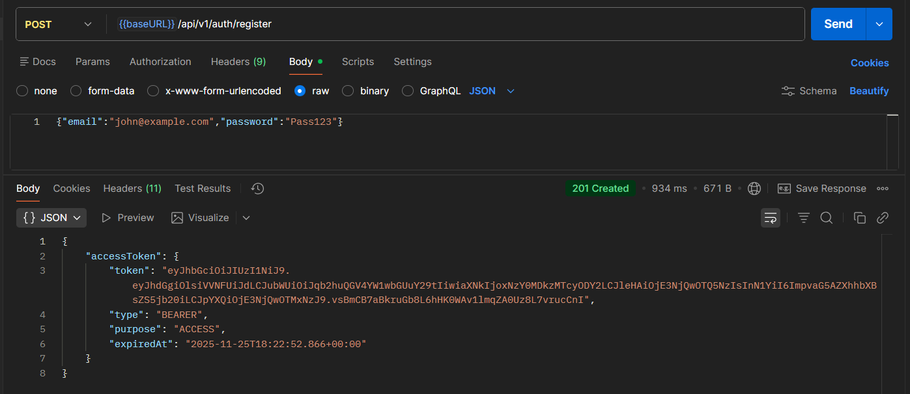
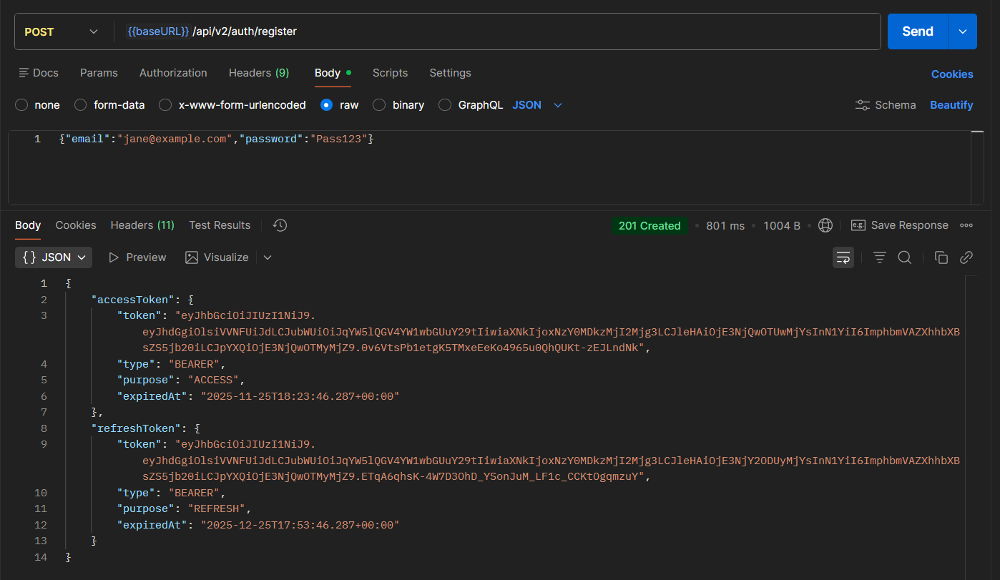
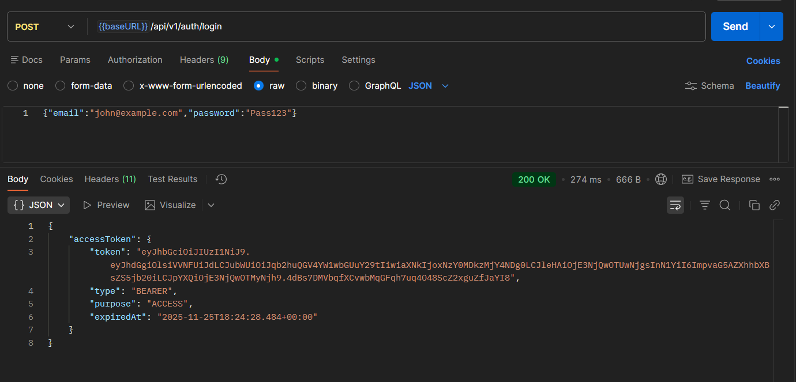
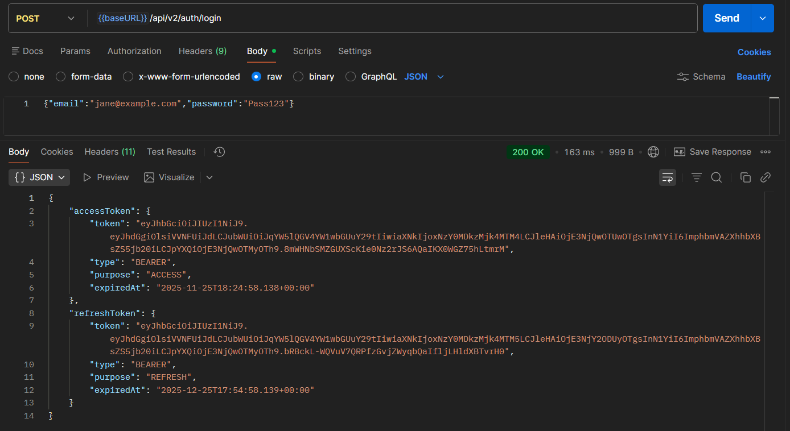
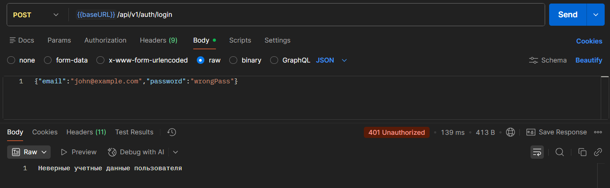
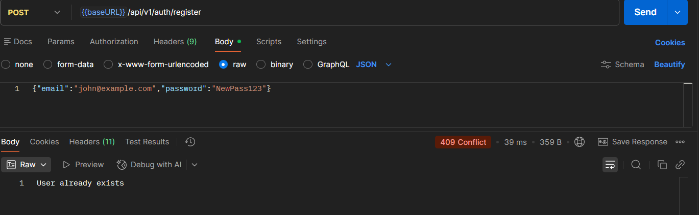
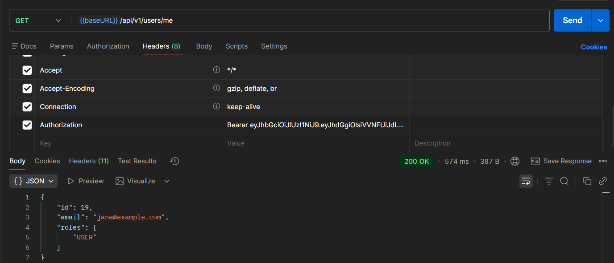
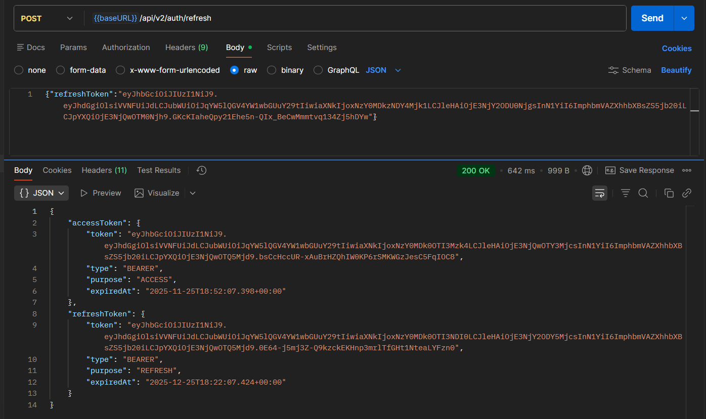
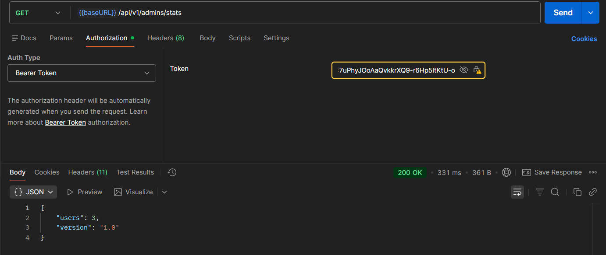

# Практическое занятие №10: JWT Токены и Refresh Token Механизм

## Выполнил: Туев Д. ЭФМО-01-25

## Описание проекта

REST API сервис с реализацией сложного механизма аутентификации и авторизации с использованием JWT (JSON Web Tokens) и Refresh Token механизма. Система предоставляет две версии API (v1 и v2): v1 использует только access token, v2 реализует двухфакторный механизм с refresh token, хранящимся в Redis. Пароли хешируются с BCrypt, access token содержит информацию о пользователе и его ролях, refresh token используется для получения нового access token без повторной аутентификации.

### Стек технологий

В проекте используются следующие технологии и инструменты:
- **Spring Boot 3.5.7** — основной фреймворк приложения
- **Spring Web** — для разработки REST API
- **Spring Security** — управление аутентификацией и авторизацией
- **Spring Data JPA** — интеграция с PostgreSQL через Hibernate
- **Spring Data Redis** — хранилище refresh token с TTL
- **Spring Validation** — валидация входных данных
- **PostgreSQL** — реляционная база данных для пользователей
- **Redis** — in-memory хранилище для refresh токенов
- **JJWT 0.12.3** — библиотека для работы с JWT токенами
- **BCrypt** — хеширование паролей
- **Lombok** — сокращение шаблонного кода
- **Maven** — управление зависимостями и сборка проекта
- **Java 17** — язык программирования
- **H2 Database** — встроенная БД для тестирования

### Поддерживаемые запросы

**Легенда:** 🔓 Открытый доступ · 🔒 Требуется ACCESS token · 👥 USER/ADMIN · 🛡️ Только ADMIN

#### API v1 (ACCESS Token only)

| Метод | Эндпоинт | Параметры | Действие | Ответ | Требования | Тело ответа |
|-------|----------|-----------|----------|-------|-----------|-------------|
| 🔓 **POST** | `/api/v1/auth/register` | - | Регистрация пользователя | `201 CREATED` | Нет | `AuthResponse` с ACCESS token |
| 🔓 **POST** | `/api/v1/auth/login` | - | Вход в систему | `200 OK` | Нет | `AuthResponse` с ACCESS token |
| 🔓 **POST** | `/api/v1/auth/addAdminAuthorities/{email}` | `email` | Назначение ADMIN ролей | `200 OK` | Нет (ХАРДКОД для обучения) | `AuthResponse` с новым ACCESS token |
| 🔒 **GET** | `/api/v1/users/me` | - | Получить текущего пользователя | `200 OK` | ACCESS token | `UserDTO` |
| 🔒 **GET** | `/api/v1/users/{id}` | `id` | Получить пользователя по ID | `200 OK` | ACCESS token + ADMIN/собственный ID | `UserDTO` |
| 🛡️ **GET** | `/api/v1/admins/stats` | - | Получить статистику | `200 OK` | ADMIN | `AdminStats` |

#### API v2 (ACCESS + REFRESH Token)

| Метод | Эндпоинт | Параметры | Действие | Ответ | Требования | Тело ответа |
|-------|----------|-----------|----------|-------|-----------|-------------|
| 🔓 **POST** | `/api/v2/auth/register` | - | Регистрация пользователя | `201 CREATED` | Нет | `AuthResponse2FA` (ACCESS + REFRESH) |
| 🔓 **POST** | `/api/v2/auth/login` | - | Вход в систему | `200 OK` | Нет | `AuthResponse2FA` (ACCESS + REFRESH) |
| 🔒 **POST** | `/api/v2/auth/logout` | - | Выход из системы | `200 OK` | ACCESS token | - |
| 🔓 **POST** | `/api/v2/auth/refresh` | - | Обновить ACCESS token | `200 OK` | REFRESH token в теле | `AuthResponse2FA` (новые токены) |
| 🔓 **POST** | `/api/v2/auth/addAdminAuthorities/{email}` | `email` | Назначение ADMIN ролей | `200 OK` | Нет | `AuthResponse2FA` (ACCESS + REFRESH) |

### Формат данных

Тело запроса (POST /api/v1/auth/register или /api/v2/auth/register):
```json
{
  "email": "user@example.com",
  "password": "securePassword123"
}
```

Тело запроса (POST /api/v1/auth/login или /api/v2/auth/login):
```json
{
  "email": "user@example.com",
  "password": "securePassword123"
}
```

Ответ (API v1 - POST /auth/register, /auth/login):
```json
{
  "accessToken": {
    "token": "eyJhbGciOiJIUzI1NiIsInR5cCI6IkpXVCJ9...",
    "type": "BEARER",
    "purpose": "ACCESS",
    "expiredAt": "2025-11-25T12:00:00Z"
  }
}
```

Ответ (API v2 - POST /auth/register, /auth/login):
```json
{
  "accessToken": {
    "token": "eyJhbGciOiJIUzI1NiIsInR5cCI6IkpXVCJ9...",
    "type": "BEARER",
    "purpose": "ACCESS",
    "expiredAt": "2025-11-25T11:00:00Z"
  },
  "refreshToken": {
    "token": "eyJhbGciOiJIUzI1NiIsInR5cCI6IkpXVCJ9...",
    "type": "BEARER",
    "purpose": "REFRESH",
    "expiredAt": "2025-12-25T10:00:00Z"
  }
}
```

Заголовок (для защищённых эндпоинтов):
```
Authorization: Bearer <ACCESS_TOKEN>
```

### Структура проекта

```
my/learn/mireaffjpractice10/
├── config/
│   ├── JwtConfig.java                          # Конфигурация JWT (secret, lifetime)
│   ├── JwtRequestFilter.java                   # Фильтр для валидации JWT токенов
│   ├── RedisConfig.java                        # Конфигурация Redis подключения
│   └── SecurityConfig.java                     # Конфигурация Spring Security
├── controller/
│   ├── AdminController.java                    # API для администраторов (/api/v1/admins)
│   ├── AuthControllerV1.java                   # API v1: ACCESS token only (/api/v1/auth)
│   ├── AuthControllerV2.java                   # API v2: ACCESS + REFRESH (/api/v2/auth)
│   └── UserController.java                     # API для пользователей (/api/v1/users)
├── dto/
│   ├── request/
│   │   ├── TokenRefreshRequest.java            # DTO для refresh endpoint
│   │   ├── UserLoginRequest.java               # DTO для логина
│   │   └── UserRegisterRequest.java            # DTO для регистрации
│   └── response/
│       ├── AdminStats.java                     # DTO статистики админа
│       ├── AuthResponse.java                   # Абстрактный класс ответа
│       ├── AuthResponse2FA.java                # DTO v2: ACCESS + REFRESH
│       ├── AuthResponsePlain.java              # DTO v1: ACCESS only
│       └── UserDTO.java                        # DTO пользователя
├── exception/
│   ├── AppException.java                       # Базовое исключение
│   └── handler/
│       └── GlobalExceptionHandler.java         # Глобальный обработчик ошибок
├── model/
│   ├── Token.java                              # POJO токена с метаданными
│   ├── TokenPurpose.java                       # Enum: ACCESS или REFRESH
│   ├── TokenType.java                          # Enum: BEARER
│   ├── User.java                               # JPA Entity пользователя
│   └── UserRole.java                           # Enum ролей (USER, ADMIN)
├── repository/
│   └── UserRepository.java                     # JPA репозиторий пользователей
├── service/
│   ├── AdminService.java                       # Сервис для админа
│   ├── RefreshTokenService.java                # Сервис управления refresh токенами
│   ├── TokenService.java                       # Генерирование ACCESS и REFRESH токенов
│   ├── UserAuthService.java                    # Бизнес-логика аутентификации
│   └── UserService.java                        # Сервис пользователей + UserDetailsService
├── util/
│   ├── CommonMapper.java                       # Маппер для преобразования сущностей
│   └── JwtTokenUtils.java                      # Утилиты для работы с JWT
└── MireaFfjPractice10Application.java          # Главный класс приложения
```

## Тестирование

Для тестирования рекомендуется использовать [Postman коллекцию](https://lively-flare-564043.postman.co/workspace/My-Workspace~fe2081e8-b325-4776-8b48-400d41f5b4bd/collection/42992055-8dca79da-4d75-43d6-be08-61b614137723?action=share&source=copy-link&creator=42992055)

### Обработка ошибок и коды ответа

| Код | Название | Где обрабатывается | Что значит / когда возвращается |
| :-- | :-- | :-- | :-- |
| 200 | OK | Все успешные операции | Успешная операция. |
| 201 | Created | `/auth/register` | Пользователь успешно зарегистрирован. |
| 400 | Bad Request | `/auth/register`, `/auth/login` | Некорректные данные (email, пароль короче 6 символов). |
| 401 | Unauthorized | Защищённые эндпоинты, невалидный JWT | Неверные учётные данные или отсутствует/невалидный token. |
| 403 | Forbidden | Защищённые эндпоинты ADMIN | Недостаточно прав доступа. |
| 404 | Not Found | `/users/{id}` | Пользователь не найден. |
| 409 | Conflict | `/auth/register` | Email уже зарегистрирован. |
| 500 | Internal Server Error | `GlobalExceptionHandler` | Непредвиденная ошибка сервера. |

### Тест кейсы

| № | Наименование | Маршрут | Запрос (пример) | Ожидаемый ответ |
|--|--|--|--|--|
| 1 | Регистрация нового пользователя (v1) | **POST /api/v1/auth/register** | `{"email":"john@example.com","password":"Pass123"}` | 201 Created + ACCESS token |
| 2 | Регистрация нового пользователя (v2) | **POST /api/v2/auth/register** | `{"email":"jane@example.com","password":"Pass123"}` | 201 Created + ACCESS + REFRESH token |
| 3 | Вход в систему (v1) | **POST /api/v1/auth/login** | `{"email":"john@example.com","password":"Pass123"}` | 200 OK + ACCESS token |
| 4 | Вход в систему (v2) | **POST /api/v2/auth/login** | `{"email":"jane@example.com","password":"Pass123"}` | 200 OK + ACCESS + REFRESH token |
| 5 | Вход с неверным паролем | **POST /api/v1/auth/login** | `{"email":"john@example.com","password":"wrongPass"}` | 401 Unauthorized |
| 6 | Регистрация дублирующегося email | **POST /api/v1/auth/register** | `{"email":"john@example.com","password":"NewPass123"}` | 409 Conflict |
| 7 | Получить текущего пользователя | **GET /api/v1/users/me** | Header: `Authorization: Bearer <ACCESS_TOKEN>` | 200 OK + UserDTO |
| 8 | Получить пользователя по ID | **GET /api/v1/users/{id}** | Header: `Authorization: Bearer <ACCESS_TOKEN>` | 200 OK + UserDTO |
| 9 | Обновить ACCESS token через REFRESH | **POST /api/v2/auth/refresh** | `{"refreshToken":"<REFRESH_TOKEN>"}` | 200 OK + новые ACCESS + REFRESH |
| 10 | Выход из системы (v2) | **POST /api/v2/auth/logout** | Header: `Authorization: Bearer <ACCESS_TOKEN>` | 200 OK |
| 11 | Получить статистику (ADMIN) | **GET /api/v1/admins/stats** | Header: `Authorization: Bearer <ACCESS_TOKEN>` (ADMIN) | 200 OK + AdminStats |

### Результаты тестирования

#### 1. Регистрация нового пользователя (v1)



Результат: **HTTP 201 Created**, пользователь зарегистрирован, возвращен ACCESS token.

#### 2. Регистрация нового пользователя (v2)



Результат: **HTTP 201 Created**, пользователь зарегистрирован, возвращены ACCESS и REFRESH токены.

#### 3. Вход в систему (v1)



Результат: **HTTP 200 OK**, пользователь аутентифицирован, возвращен ACCESS token.

#### 4. Вход в систему (v2)



Результат: **HTTP 200 OK**, пользователь аутентифицирован, возвращены ACCESS и REFRESH токены.

#### 5. Вход с неверным паролем



Результат: **HTTP 401 Unauthorized**, пароль не совпадает с хешем.

#### 6. Регистрация дублирующегося email



Результат: **HTTP 409 Conflict**, email уже зарегистрирован в системе.

#### 7. Получить текущего пользователя



Результат: **HTTP 200 OK**, возвращена информация о текущем пользователе.

#### 8. Получить пользователя по ID


Результат: **HTTP 200 OK**, возвращена информация о пользователе (с проверкой прав).

#### 9. Обновить ACCESS token через REFRESH



Результат: **HTTP 200 OK**, выданы новые ACCESS и REFRESH токены, старый REFRESH удален из Redis.

#### 10. Выход из системы (v2)


Результат: **HTTP 200 OK**, REFRESH token удален из Redis.

#### 11. Получить статистику (ADMIN)



Результат: **HTTP 200 OK**, возвращена статистика (количество пользователей, версия).

## Настройка сервера

### Переменные окружения

Для корректной работы приложения необходимо указать следующие переменные окружения в файле `application.properties` или через переменные окружения системы:

| Переменная окружения | Описание | Пример |
|------------|----------|----------|
| REDIS_HOST | Хост Redis сервера | localhost |
| REDIS_PORT | Порт Redis сервера | 6379 |
| REDIS_PASSWORD | Пароль Redis | password |
| DB_URL | URL подключения к PostgreSQL | jdbc:postgresql://localhost:5432/practice10_db |
| DB_USER | Имя пользователя БД | postgres |
| DB_PASSWORD | Пароль пользователя БД | password |


## Дополнительно

### Теоретические основы

#### JWT (JSON Web Token)

JWT — это компактный, URL-safe способ передачи информации между сторонами. Структура JWT:
- **Header** — информация о типе токена и алгоритме подписи (HS256)
- **Payload** — утверждения (claims) с информацией о пользователе
- **Signature** — криптографическая подпись для верификации

**Преимущества JWT:**
- Stateless — не требует хранения на сервере (в отличие от session)
- Масштабируемость — работает в микросервисной архитектуре
- CORS-friendly — легко передавать через Headers
- Mobile-friendly — подходит для мобильных приложений

#### Access Token vs Refresh Token

- **Access Token** — краткосрочный (1-15 минут), содержит информацию о пользователе и ролях, используется для доступа к защищённым ресурсам
- **Refresh Token** — долгосрочный (7-30 дней), хранится в защищённом хранилище (Redis), используется для получения нового Access Token без повторной аутентификации

**Почему использовать Refresh Token:**
- Безопасность — если Access Token скомпрометирован, он действует ограниченное время
- Гибкость — можно отозвать доступ через удаление Refresh Token из Redis
- Функциональность — можно реализовать logout, смену пароля с инвалидацией

#### Redis для Refresh Token

Redis используется для хранения Refresh Token с TTL (Time To Live):
- Быстрый доступ — O(1) для проверки токена
- TTL поддержка — автоматическое удаление устаревших токенов
- Масштабируемость — поддержка распределённого хранилища
- Безопасность — отделение от основной БД

#### JwtRequestFilter и Security Context

JwtRequestFilter — фильтр Spring Security, который:
1. Извлекает JWT из заголовка `Authorization: Bearer <TOKEN>`
2. Валидирует подпись и время истечения
3. Извлекает username и роли из payload
4. Устанавливает Authentication в SecurityContext
5. Позволяет дальнейшим фильтрам/контроллерам использовать пользователя

### Ключевые фрагменты кода

#### 1. JwtConfig с конфигурацией параметров

```java
@Configuration
public class JwtConfig {
    @Value("${jwt.secret}")
    private String secret;

    @Getter
    @Value("${jwt.lifetime.access}")
    private Duration accessLifetime;

    @Getter
    @Value("${jwt.lifetime.refresh}")
    private Duration refreshLifetime;

    @Bean
    public SecretKey secretKey() {
        byte[] keyBytes = Decoders.BASE64.decode(secret);
        return Keys.hmacShaKeyFor(keyBytes);
    }
}
```

#### 2. TokenService для генерирования JWT токенов

```java
@Service
@RequiredArgsConstructor
public class TokenService {
    private final JwtConfig jwtConfig;
    private final JwtTokenUtils jwtTokenUtils;
    private final RedisTemplate<Long, String> redisTemplate;

    public Token generateAccessToken(UserDetails userDetails) {
        Date issuedDate = new Date();
        Date expiredDate = new Date(
            issuedDate.getTime() + jwtConfig.getAccessLifetime().toMillis()
        );
        String token = jwtTokenUtils.generateToken(userDetails, issuedDate, expiredDate);
        return Token.builder()
                .type(TokenType.BEARER)
                .purpose(TokenPurpose.ACCESS)
                .expiredAt(expiredDate)
                .token(token)
                .build();
    }

    public void saveRefreshToken(Long id, Token token) {
        redisTemplate.opsForValue().set(id, token.getToken(), jwtConfig.getRefreshLifetime());
    }
}
```

#### 3. JwtRequestFilter для валидации токенов

```java
@Component
@RequiredArgsConstructor
public class JwtRequestFilter extends OncePerRequestFilter {
    private final JwtTokenUtils jwtTokenUtils;

    @Override
    protected void doFilterInternal(HttpServletRequest request, HttpServletResponse response, FilterChain filterChain) throws ServletException, IOException {
        String header = request.getHeader("Authorization");
        String token = null;
        String username = null;

        if (header != null && header.startsWith("Bearer ")) {
            token = header.substring(7);
        }

        if (token != null) {
            try {
                username = jwtTokenUtils.getUsernameFromToken(token);
            } catch (AppException e) {
                response.setStatus(e.getStatus().value());
                return;
            }
        }

        if (username != null && SecurityContextHolder.getContext().getAuthentication() == null) {
            UsernamePasswordAuthenticationToken authToken = new UsernamePasswordAuthenticationToken(
                    username,
                    null,
                    jwtTokenUtils.getAuthoritiesFromToken(token)
            );
            SecurityContextHolder.getContext().setAuthentication(authToken);
        }

        filterChain.doFilter(request, response);
    }
}
```

#### 4. JwtTokenUtils для создания и парсинга JWT

```java
@Component
@RequiredArgsConstructor
public class JwtTokenUtils {
    private final SecretKey secretKey;

    public String generateToken(UserDetails userDetails, Date issuedDate, Date expiredDate) {
        Map<String, Object> claims = new HashMap<>();
        List<String> authorities = userDetails.getAuthorities().stream()
                .map(r -> r.getAuthority())
                .toList();
        claims.put("ath", authorities);
        claims.put("nme", userDetails.getUsername());

        return Jwts.builder()
                .claims(claims)
                .subject(userDetails.getUsername())
                .issuedAt(issuedDate)
                .expiration(expiredDate)
                .signWith(secretKey, Jwts.SIG.HS256)
                .compact();
    }

    public String getUsernameFromToken(String token) {
        Claims claims = getClaimsFromToken(token);
        return claims.getSubject();
    }

    private Claims getClaimsFromToken(String token) throws AppException {
        try {
            return Jwts.parser()
                    .verifyWith(secretKey)
                    .build()
                    .parseSignedClaims(token)
                    .getPayload();
        } catch (JwtException | IllegalArgumentException e) {
            throw new AppException(e.getMessage(), HttpStatus.UNAUTHORIZED);
        }
    }
}
```

#### 5. AuthControllerV2 с двухфакторным механизмом

```java
@RestController
@RequestMapping("/api/v2/auth")
@RequiredArgsConstructor
public class AuthControllerV2 {
    private final TokenService tokenService;
    private final UserAuthService userAuthService;
    private final CommonMapper mapper;

    @PostMapping("/register")
    @Transactional
    public ResponseEntity<AuthResponse> registerUser(@RequestBody @Valid UserRegisterRequest req) {
        User saved = userAuthService.registerUser(req);
        Token access = tokenService.generateAccessToken(saved);
        Token refresh = tokenService.generateRefreshToken(saved);
        tokenService.saveRefreshToken(saved.getId(), refresh);
        
        return new ResponseEntity<>(
            mapper.mapToAuthResponse(access, refresh),
            HttpStatus.CREATED
        );
    }

    @PostMapping("/refresh")
    public ResponseEntity<AuthResponse> refreshToken(@RequestBody @Valid TokenRefreshRequest req) {
        User user = userAuthService.refreshToken(req);
        Token accessToken = tokenService.generateAccessToken(user);
        Token refreshToken = tokenService.generateRefreshToken(user);
        tokenService.saveRefreshToken(user.getId(), refreshToken);

        return new ResponseEntity<>(
            mapper.mapToAuthResponse(accessToken, refreshToken),
            HttpStatus.OK
        );
    }

    @PostMapping("/logout")
    public ResponseEntity<?> logout() {
        userAuthService.logoutUser();
        return ResponseEntity.ok().build();
    }
}
```

#### 6. RedisConfig для подключения к Redis

```java
@Configuration
public class RedisConfig {
    @Value("${spring.redis.host}")
    private String host;
    @Value("${spring.redis.port}")
    private String port;
    @Value("${spring.redis.password}")
    private String password;

    @Bean
    public RedisConnectionFactory redisConnectionFactory() {
        RedisStandaloneConfiguration config = new RedisStandaloneConfiguration();
        config.setHostName(host);
        config.setPort(Integer.parseInt(port));
        config.setPassword(password);
        return new LettuceConnectionFactory(config);
    }

    @Bean
    public RedisTemplate<Long, String> jwtRedisTemplate(RedisConnectionFactory rcf) {
        RedisTemplate<Long, String> template = new RedisTemplate<>();
        template.setConnectionFactory(rcf);
        return template;
    }
}
```

### Контрольные вопросы

#### 1. Чем отличаются API v1 и v2?

- **v1 (ACCESS только)**
  - Более простой механизм
  - ACCESS token с длительным временем жизни (часы-дни)
  - Нет возможности logout/отозвать доступ
  - Если token скомпрометирован, доступ действует длительное время
  - Подходит для тестирования и простых приложений

- **v2 (ACCESS + REFRESH)**
  - Более сложный, но более безопасный механизм
  - ACCESS token с коротким временем жизни (минуты-часы)
  - REFRESH token с длительным TTL хранится в Redis
  - Возможность logout через удаление REFRESH token
  - Если ACCESS скомпрометирован, риск ограничен
  - Подходит для production приложений

#### 2. Как работает Refresh Token механизм?

1. Пользователь регистрируется/логинится → получает ACCESS и REFRESH токены
2. ACCESS используется для доступа к ресурсам
3. Когда ACCESS истекает → client отправляет REFRESH token на `/refresh`
4. Server валидирует REFRESH (проверяет в Redis)
5. Server выдает новые ACCESS и REFRESH токены
6. Старый REFRESH удаляется из Redis

**Преимущества:**
- Безопасность: ACCESS имеет короткую жизнь
- Контроль: можно отозвать доступ через DELETE из Redis
- Гибкость: можно реализовать logout

#### 3. Почему JWT должен быть подписан?

Подпись обеспечивает:
- **Целостность** — нельзя изменить payload без инвалидирования подписи
- **Аутентичность** — только сервер с private key может создать валидную подпись
- **Неотрицаемость** — server не может отрицать, что выдал этот token

**Процесс верификации:**
```
1. Client отправляет JWT: HEADER.PAYLOAD.SIGNATURE
2. Server вычисляет новую подпись HEADER + PAYLOAD + SECRET_KEY
3. Server сравнивает вычисленную подпись с SIGNATURE из JWT
4. Если совпадают → JWT валиден
```

#### 4. Где и как хранить JWT в клиенте?

**LocalStorage:**
- ✅ Просто использовать
- ❌ Подвержен XSS (JavaScript может украсть)

**SessionStorage:**
- ✅ Автоматически очищается при закрытии браузера
- ❌ Подвержен XSS

**HttpOnly Cookie:**
- ✅ Защищен от XSS (недоступен JavaScript)
- ✅ Защищен от CSRF (если правильно настроить)
- ❌ Сложнее реализовать

**Рекомендация:** HttpOnly Cookie для production, LocalStorage для prototyping

#### 5. Зачем нужен JwtRequestFilter?

JwtRequestFilter нужен для:
- Извлечения JWT из каждого запроса
- Валидации подписи и времени истечения
- Установки Authentication в SecurityContext
- Использования пользователя в контроллерах через `@PreAuthorize`, `SecurityContextHolder`, etc.

**Без фильтра:** Spring Security не знал бы о JWT-аутентифицированном пользователе

#### 6. Как реализовать logout в JWT?

**Три способа:**

1. **Blacklist (для v1)** — хранить "невалидные" токены в Redis
2. **Refresh Token invalidation (v2)** — удалить REFRESH token из Redis
3. **Short-lived tokens** — ACCESS быстро истекает, нет необходимости logout

**В проекте (v2):** используется способ 2 — удаление REFRESH token инвалидирует доступ

#### 7. Почему Redis лучше как БД для Refresh Token?

- **Скорость** — O(1) доступ vs O(n) поиск в БД
- **TTL** — автоматическое удаление vs ручная очистка
- **Масштабируемость** — In-memory vs disk I/O
- **Простота** — простые операции vs сложные SQL запросы

## Выводы

В результате выполнения практического занятия №10 был разработан REST API сервис с комплексной реализацией механизма аутентификации и авторизации с использованием JWT токенов и Refresh Token механизма. Проект демонстрирует production-ready подход к безопасности веб-приложений.

**Достигнутые результаты:**

- Реализована двухуровневая аутентификация: ACCESS и REFRESH токены
- Использован JWT (JJWT 0.12.3) для создания и верификации токенов
- Реализовано хранилище Refresh Token в Redis с автоматическим TTL
- Создан JwtRequestFilter для валидации токенов в каждом запросе
- Реализованы две версии API: v1 (простая) и v2 (с Refresh Token)
- Реализована функция logout через инвалидацию Refresh Token
- Реализована защита эндпоинтов через `@PreAuthorize` аннотации
- Пароли хранятся в хешированном виде с использованием BCrypt
- Реализована обработка ошибок аутентификации (401, 403)

**Приобретённые навыки:**

- Работа с JWT токенами и JJWT библиотекой
- Реализация Refresh Token механизма
- Интеграция с Redis для хранения долгосрочных данных
- Создание custom Spring Security фильтров
- Использование `@PreAuthorize` для Method-level security
- Работа с UserDetails и Authentication в SecurityContext
- Безопасное хранение паролей с BCrypt
- Проектирование двухуровневой архитектуры аутентификации
- Обработка исключений при работе с JWT

Проект готов к дальнейшему расширению функциональности (добавление двухфакторной аутентификации через OTP, социальная аутентификация, аудит действий, анализ поведения и т.д.).
